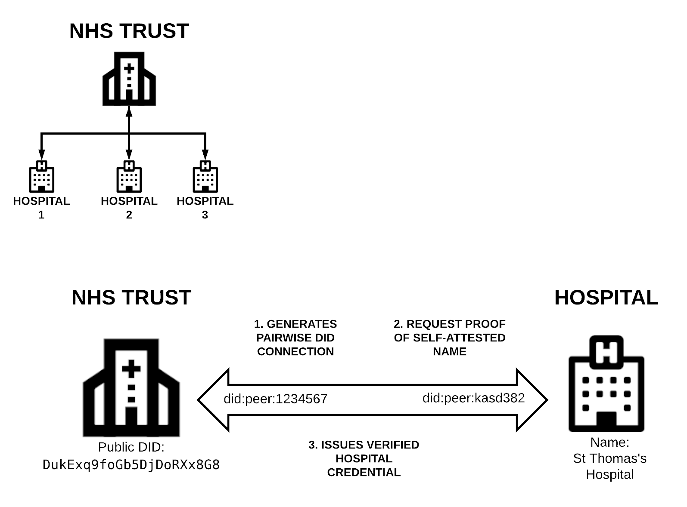
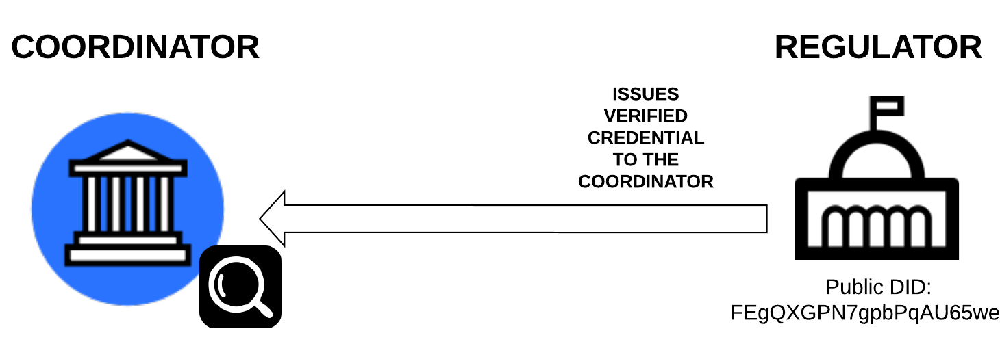
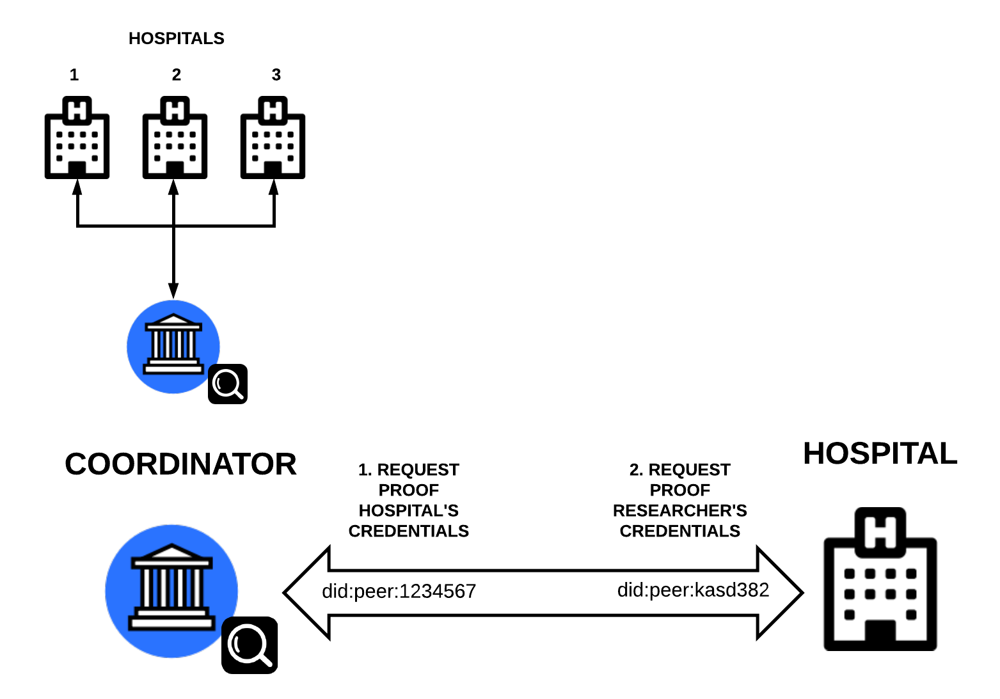
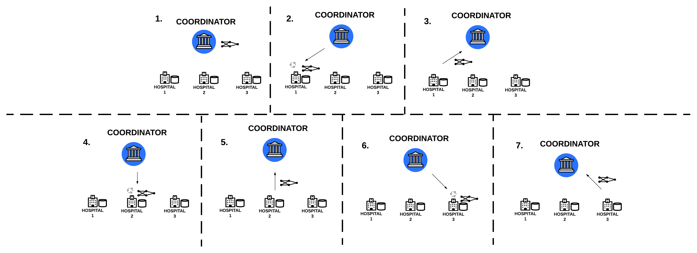

# Team-43
__Distributed Deep-learning DID-acts__

This repo has been forked from Hyperledger Aries Cloud agent [link](https://github.com/hyperledger/aries-cloudagent-python) provided by British Columbia Government.

We have created a set of agents that can be run using docker to experiment with a federated deep learning scenario using didCOMM to pass secure messages between the participants - e.g. the ML model parameters. Furthermore the scenario explores using credentials so that participants can verify that who they are communicating with. In the example this is verifying a hospital is indeed a hospital and a researcher has been accredited by a regulator. However the credentials abnd issuers within this use case could be adapted to any ecosystem.

The agents connect, by default, to the BC government development instance of Hyperledger Indy ledger [link](http://dev.bcovrin.vonx.io).


# Guide


To run the scenario:

```
git clone https://github.com/blockpass-identity-lab/diffusion2019.git

cd demo
```

## Hospital gets verified by the NHS Trust.



1) Start the NHS Trusted agent.
```
./run_demo nhsheadoffice
```
2) Start one of the hospitals.
```
./run_demo hospital1
```
3) Use NHS's invitation URL to connect the hospital to it.

4) Trust requests proof of hospitals name (Self attested)

5) NHS Trust issue verified hospital credential to the Hospital.

## The Researcher gets accredited by the regulatory authority.



6) Start the Coordinator.
```
./run_demo coordinator
```

7) Start the regulator.

```
./run_demo regulator
```

8) Follow the on-screen menu on the coordinator (4) to input connection url from the regulator.

9) Follow the on-screen menu to Issue a credential from the Regulator to the Coordinator.


## The researcher validates the hospital's credential. The hospital validates the researcher's accreditation. The training procedure starts.



10) Follow the on-screen menu on the Coordinator (3) to create New Invitation for the hospital.

11) Follow the on-screen menu in the hospital terminal to accept the new invitation link from the coordinator, and connect to it.

12) Follow the on-screen menu so the coordinator can check the hospital's credentials. If proof is valid, the coordinator adds this hospital to the list of the trusted connections.

13) Follow the on-screen menu to check from the hospital terminal, the coordinator's credentials.

14) After the hospitall has been added to the coordinator's trusted list, can be start the training process by accepting the model from the coordinator, trains the model, and sends back the updated model (updated model parameters) to the coordinator. Afterwards, coordinator sends the new updated model to the next hospital to continue the training until the full training procedure has been completed.



# The Ledger that has been used:

LEDGER_URL=http://dev.bcovrin.vonx.io ./run_demo $AGENT_NAME

# Created by

    Will Abramson
    Adam James Hall
    Pavlos Papadopoulos
