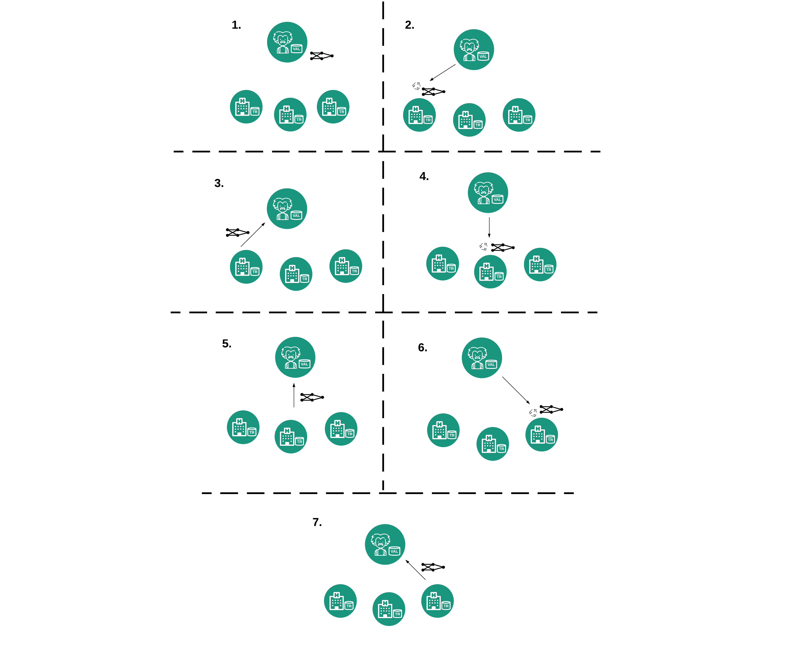

# Distributed Deep-learning with HL-Aries

This repo has been forked from Hyperledger Aries Cloud agent [link](https://github.com/hyperledger/aries-cloudagent-python) provided by British Columbia Government.

We have created a set of agents that can be run using docker to experiment with a federated deep learning scenario using didCOMM to pass secure messages between the participants - e.g. the ML model parameters. Furthermore the scenario explores using credentials so that participants can verify that who they are communicating with. In the example this is verifying a hospital is indeed a hospital and a researcher has been accredited by a regulator. However the credentials abnd issuers within this use case could be adapted to any ecosystem.

The agents connect, by default, to the BC government development instance of Hyperledger Indy ledger [link](http://dev.bcovrin.vonx.io).


# Guide


To run the scenario:

```
git clone https://github.com/blockpass-identity-lab/aries-fl-demo.git

cd demo
```

## Hospital gets verified by the NHS Trust.

1. Start the NHS Trusted agent.
    ```
    ./run_demo nhsheadoffice
    ```
2) Start each of the hospitals in separate terminals.
    ```
    ./run_demo hospital1(2,3)
    ```
3) Copy NHS's invitation URL into the hospitals terminal to initiate DIDExchange and establish pairwise DID connection.

4) Issue verified hospital credential to the Hospital. This first requests a self attested proof of hospital name from the hospital then issues this name in a credential.

5) Create new invitation from the NHSTrust and repeat steps 3 and 4 for each hospital

## The Researcher gets accredited by the regulatory authority.

6) Start the Coordinator.
```
./run_demo coordinator
```

7) Start the regulator.

```
./run_demo regulator
```

8) Enter command to allow coordinator to accept new invitation

9) Copy regulator's invitation URL into coordinator terminal.

10) Issue a credential from the Regulator to the Coordinator.


## The researcher validates the hospital's credential. The hospital validates the researcher's accreditation. The training procedure starts.


11) Create New Invitation in the coordinator for the hospital.

12) Input new connection into the hospital terminal

13) Coordinator request proof connection is from a valid hospital. If proof is valid, the coordinator adds this hospital to the list of the trusted connections.

14) Hospital to request proof that the coordinator connection is from a certified research. If so add to list of trusted connections.

15) Either add another trusted connection between a new hospital and current researcher by repeating steps 11 - 14

or..

16) In the coordinator terminal initiate training process which loops through all trusted hospital connections in turn, sending a message containing the model. The hospital checks if the message is from a trusted research, if so they initiate the training process using their private date. Once complete the trained model is sent back to the coordinator who validates the model and forwards it onto the next trusted connection.





# Created by

    Will Abramson (wip-abramson)
    Adam James Hall (H4LL)
    Pavlos Papadopoulos (pavlos-p)
