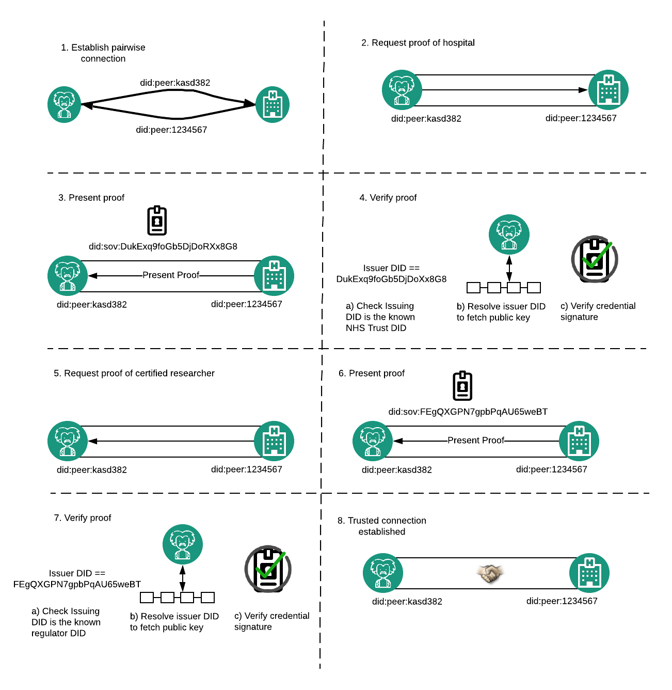

# Diffusion Hackathon 2019

Hailing from the Blockpass Identity Lab, based in sunny-Scotland, our team of three travelled to Berlin to participate in Diffusion; a hackathon hosted by Outlier Ventures which centered around the application and amalgamation of distributed ledger technology (DLT), cryptography, IoT and machine learning. Upon arrival we were met by 44 other teams from across the globe, converging upon this space and time, all committed to the utilisation of pioneering technologies to experiment with and build tools which could benefit society in the next generation of the internet.

When walking through the door of Factory, Berlin, there was a palpable feeling of community. We were blown away by both the pedigree of participants and their willingness to have conversations about their experiences and insights as the pioneers of web 3.0. This gave us ample opportunity to leverage the expertise from various mentors and other teams in further developing both our project idea and, as PhD students, our future research interests. Having said this, there were times where we worried that this atmosphere would be our downfall, as quick trips to grab some coffee morphed into 45 minute tangentila conversations around the largely uncharted territory where privacy, machine-learning and DLT meet.

Our team was composed of three PhD researchers; Will, Pavlos and Adam. We specialise in decentralised Identity, DLT and privacy-preserving machine-learning respectively. We wanted to create a project which would leverage all of our strengths. For this reason, we went down the path of developing a solution implementing distributed-learning with permissions being managed by agents through Decentralised Identifiers (DIDs) and Verifiable Credentials (VCs). While our solution would theoretically accommodate data and models from any application domain, we chose to build our use-case around distributed learning on health data. Specifically, we chose to facilitate private learning on a dataset which would allow for the diagnosis of
[mental health in tech](https://www.kaggle.com/osmi/mental-health-in-tech-survey).

## Hyperledger Aries

We chose to focus on Hyperledger Aries to provide the identity capabilities required for our project, specifically we built on the [aries-cloudagent-python code](https://github.com/hyperledger/aries-cloudagent-python). Aries was spun out of the Hyperledger Indy codebase early 2019 to separate out the ledger-based code from what is often termed as agent-based code. Hyperledger Aries states its purpose as, “Hyperledger Aries provides a shared, reusable, inter-operable toolkit designed for initiatives and solutions focused on creating, transmitting and storing verifiable digital credentials”. Aries aims to be ledger agnostic, so while it currently only supports Hyperledger Indy, it is being designed in such a way to enable Aries agents support multiple pluggable ledgers in the future.

One of the most interesting features of this new wave of identity innovation is the ability to create unique pairwise Decentralised Identifier connections between agents, otherwise known as [Peer DIDs](https://openssi.github.io/peer-did-method-spec/index.html). A specification for these identifiers is under development. An agent is able to establish connections with others by providing a different unique Peer DID which they can cryptographically authenticate as controlling, this adds both privacy and security. Once a connection is established, the Aries protocol [DIDComm](https://github.com/hyperledger/aries-rfcs/tree/master/concepts/0005-didcomm) enables secure, encrypted communication between agents. This can be used for sending messages as well as presentation of proofs and receiving Verifiable Credentials. It is our belief that Peer DIDs and the secure communication channels they enable will become a foundational building block for the next generation of digital innovation.

## Distributed Machine-Learning

A form of privacy-preserving machine learning that has been growing in popularity for some time now is Federated Learning (FL). For the first iteration of our solution, we decided to implement FL in its most basic form, where plain-text models are sent between agents. The coordinator begins with a model and a dataset to validate it's accuracy. The coordinator benchmarks the accuracy of the model and then sends it to be trained by a hospital. The hospital trains the model on their training data and then sends the updated model back to the Coordinator. The Coordinator benchmarks the model against their validation set and then sends it to the next hospital. This process repeats until the model has been trained on each federated dataset. We refer to this as Vanilla FL.

Due to the fact that no data changes hands, this technique is a step in the right direction when compared to traditional, centralised learning. However, some issues still exist with this approach. Vanilla FL is vulnerable to model stealing by hospital agents as they can just keep a copy of the researchers model after training it. In business cases where the model represents intellectual-property, to be protected by the Coordinator, this set up is not ideal.  On the other hand, with knowledge of the model before and after training on each private dataset, the Coordinator could theoretically infer the data used to train the model at each iteration. Model inversion attacks are also possible by the research Coordinator where, given an infinite number of queries to the model and carefully crafted input features, the researcher could theoretically reverse engineer training values.

While Vanilla FL is vulnerable to these attacks, we resolved to design an MVP where this basic functionality can be expanded upon to mitigate these threats. Specifically, to mitigate model inversion attacks we can implement differentially private training mechanisms for the deep learning model ([PyVacy](https://smartech.gatech.edu/handle/1853/61412)). To mitigate the threats of model stealing and training data inference, Secure Multiparty Computation (SMC) can be leveraged to split data and model parameters into shares. This allows both gradients and parameters to be computed and updated in a decentralised fashion, where custody of each data item is split into shares to be held by relevant participating entities.

## Our Solution

We aimed to build a basic federated learning example between Hyperledger Aries agents. This would leverage the peer to peer DID communication protocol (DIDComm) implemented in Hyperledger Aries as the transport protocol. The use of Hyperledger Aries agents also enabled us to implement a simple credential ecosystem with the following agents;

+ NHS Trust (Hospital Credential Issuer)
+ Hospital (Data Provider)
+ Researcher (Machine Learning Coordinator)
+ Regulator (Researcher Credential Issuer)

This was used to facilitate the authorisation of training participants and Coordinators. A data scientist who would like to train a model is given credentials by an industry watchdog, who in a real world scenario could audit the model and research purpose. Meanwhile, a hospital in possession of private health data could be issued with credentials by an NHS authority. Credential schema and the DIDs of credential issuers are written to a public ledger - we used the [development ledger provided by the government of British Columbia] (http://dev.bcovrin.vonx.io/) in our example. When issuing a credential, the issuer creates a signature on a set of attributes for a given schema using a private key associated with their public DID through a DID document. Included in these attributes is a blinded link secret for the entity receiving the credential - this enables the credential to be tied to a particular entity without the issuer needing to know this secret value.

When verifying the proof of a credential, the verifier needs to check a number of things.
1. The DID of the issuer can be resolved on the public ledger to a DID document. This document should contain a public key which can be used to verify the integrity of the credential.
2. The entity presenting the credential does indeed know the link secret that was blindly signed by the issuer. The holder creates a zero knowledge proof attesting to this.
3. That the issuing DID had the authority to issue this kind of credential. The signature alone only proves integrity, but if the verifier accepts hospital credentials from any issuers then it would be easy to obtain fraudulent credentials - anyone with a public DID could issue one. For the demo we hardcode the the public DIDs into the relevant verifiers. In a production system at scale this might be done through a registry, supported by a governance framework - a legal document outlining the rules of the ecosystem.
4. Finally, the verifier needs to check that the attributes in the valid credential meet the criteria for authorisation in the system. For this simple usecase, simply proof of the correct credential is deemed acceptable.
5. Not included in this example, but in general a verifier would need to additionally check that the credential has not been revoked by the issuer. They would do this by checking against a revocation registry stored on the public ledger.

Any entity with a verifiable credential from the trusted issuers in the credential ecosystem is capable of presenting a proof of this credential across a pairwise peer-to-peer DID connection. Using this, authorised parties are able to mutually authenticate each other as trusted entities. In the proposed ecosystem, this allowed agents to generate a trusted communication channel. Across this channel the communication of model parameters for federated-learning stored in a torch file took place.

In order to implement Vanilla FL, we split our original data-set into 4 partitions, three training-sets and one validation-set. This data was loaded into three distinct hospital agents as they were containerised from dockerfiles. Each hospital also loaded in data-cleaning and training logic to be used on data and models respectively. On the other hand, our training Coordinator docker agent loaded in the untrained model parameters during the containerisation process. Once the container was initialised, the Coordinator created a connection url which was shared with participating hospitals. This creates a pairwise DID connection between the hospital and the coordinator - they generate and share unique private peer DIDs with DID Documents containing an endpoint for secure communication. It is worth pointing out that though this connection is secure, it is not necessarily trusted. All the parties know about the other is that they are in control of the identifier they provided. In order to build trust across this connection the parties need to prove aspects about themselves. A Hospital proves they are a hospital to a coordinator by proving they are in possession of a Credential issued by the NHS authority. Likewise the Research Coordinator does the same with a research credential. Once this handshake has taken place, both parties in the connection know they can trust the other for the specific use case of Vanilla FL. Therefor, the coordinator is now willing to share the model with the hospital and the hospital is willing to train the model on it's private data and return the trained model to the coordinator.

This amalgamation of Aries and FL allowed us to mitigate some existing constraints of FL produced by a lack of trust between training participants. Specifically these were;

+ Malicious data being provided by a false hospital to spoil model accuracy on future cases.
+ Malicious models being sent to hospitals with the intention of memorising private training data values verbatim

With trusted credentials baked into the communications protocols, agents would not be capable of participating in training without having been approved by whatever governing bodies have been deemed appropriate. This makes the participation of malicious entities far more difficult as they will first have to get around industry gate-keepers.

## Running the demo

Instructions to run the demo can be found in our [repo](https://github.com/blockpass-identity-lab/diffusion2019).

## Conclusion

By the end of the Diffusion, we had implemented all 4 types of agents with the credential ecosystem designed, we also had a working deep-learning model able to learn from the private data. We ran out of time to combine the two such that communication of model parameters happened across the trusted DID connections established. However, this was always going to be a challenge. The current DIDComm implemented in Aries only supports basic *string* text messages, whereas we were trying to send a *byte-array* file containing the untrained model.

While what we created wasn’t complete we were pleased with the progress we made and managed to win two tracks - Best Social Impact in the Identity track and Machine Learning in a Decentralised World.
